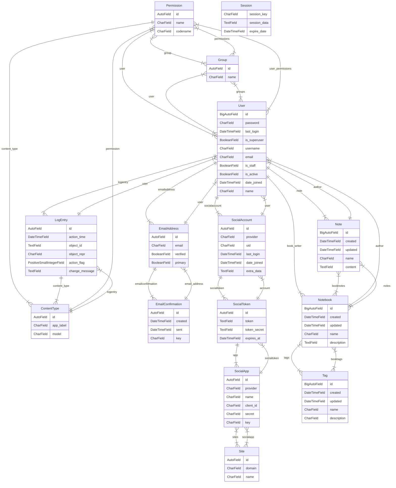

## DJ Notes

### A Note taking app powered by Django

License: MIT

### What is DJ Notes

- A Note Taking App
- Collect your thoughts in the form of notes or collections of notes(books)
- Secure Note taking experience
- Markdown Support

### Tech Stack

- Django
- PostgreSQL
- Nixpack
- Cookiecutter Template

### Preview

 

## DJ Notes's ER Diagram

